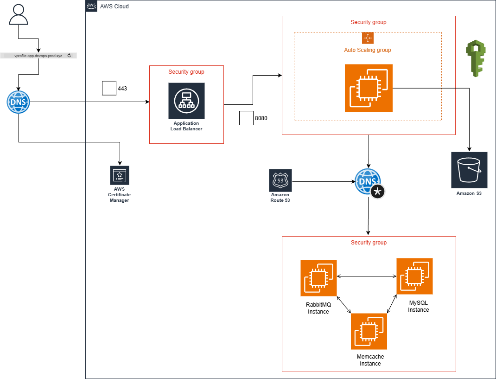

# 🧰 VProfile Project (Cloud setup)

This document outlines the cloud-based deployment architecture for the **VProfile** multi-tier application using a **Lift & Shift** migration strategy.

The Lift & Shift approach moves an existing on-premises application to the cloud **with minimal modifications**, enabling organizations to rapidly adopt cloud infrastructure while preserving their existing application logic, structure, and dependencies.

## 🏗️ High-Level Architecture Overview

The architecture mirrors the traditional on-premises setup but is fully hosted on AWS, leveraging core cloud services for compute, DNS, storage, availability, and scalability.

## 🔄 Deployment Flow (Step-by-Step Execution)

The following sequence outlines the complete Lift & Shift deployment workflow for hosting the VProfile application in AWS:

1. Create Security Groups
2. Create a Key Pair
3. Launch EC2 Instances with User Data
4. Update DNS Records in Route 53
5. Build the Application Artifact
6. Upload Artifact to S3
7. Download Artifact to Tomcat EC2 Instance
8. Configure Elastic Load Balancer (ELB) with HTTPS
9. Map ELB Endpoint in GoDaddy DNS
10. Verify Application Accessibility
11. Configure Auto Scaling for Tomcat Tier
