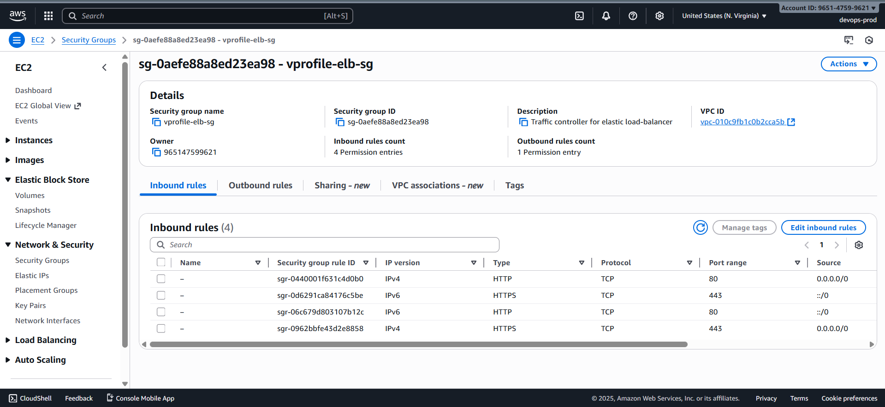
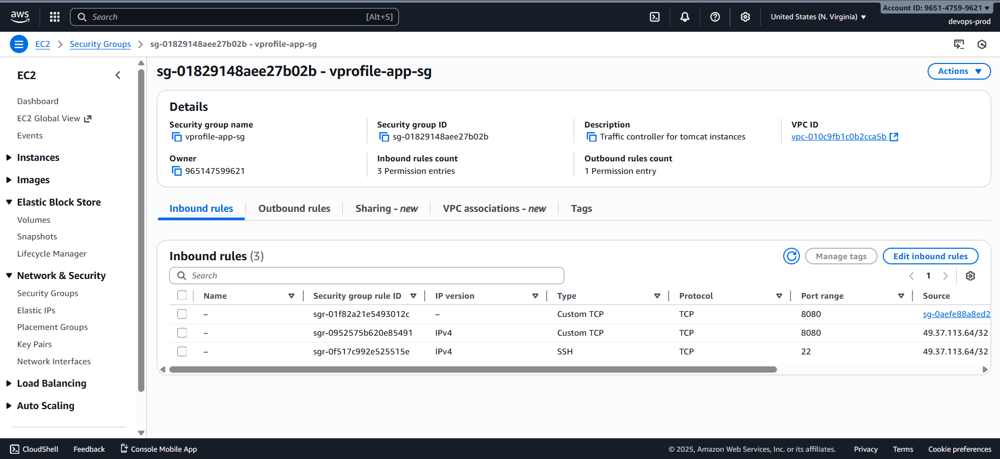
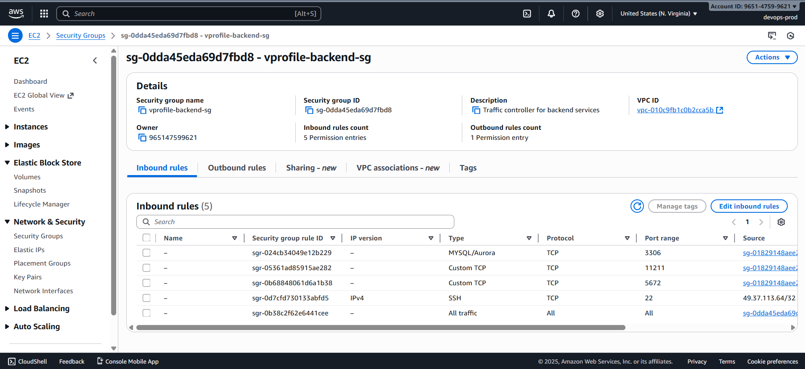
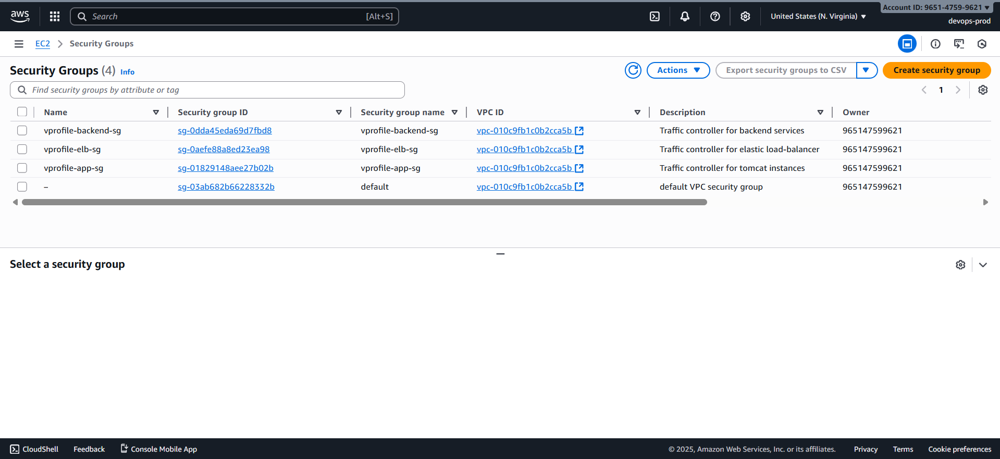
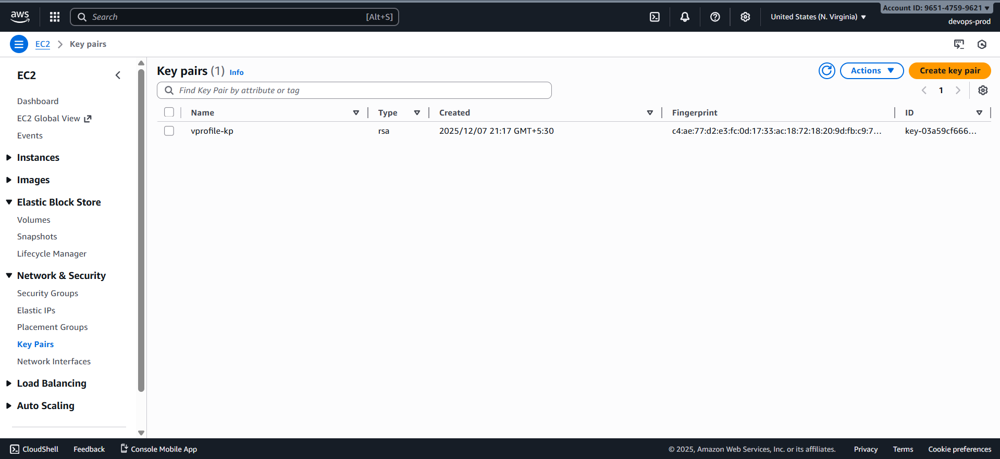

# 🔐 Security Groups & Key Pair Setup

---

First to set up the security groups and a key pair needed for the deployment as security groups will control the traffic to and from the instances, while key pairs will be used for secure access to the instances.

---

### 1️⃣ Create Security Groups

#### 🛡️ vprofile-elb-sg

**Inbound Rules**

- HTTP — TCP 80 — Anywhere (IPv4)
- HTTP — TCP 80 — Anywhere (IPv6)
- HTTPS — TCP 443 — Anywhere (IPv4)
- HTTPS — TCP 443 — Anywhere (IPv6)

**Outbound Rules**

- Allow all (default)

---

#### 🛡️ vprofile-app-sg

**Inbound Rules**

- Custom TCP — 8080 — Source: _vprofile-elb-sg_
- Custom TCP — 8080 — Source: _your-ip-address/32_
- SSH — TCP 22 — Source: _your-ip-address/32_

**Outbound Rules**

- Allow all (default)

---

#### 🛡️ vprofile-backend-sg

**Inbound Rules**

- MySQL/Aurora — 3306 — Source: _vprofile-app-sg_
- Custom TCP — 11211 — Source: _vprofile-app-sg_
- Custom TCP — 5672 — Source: _vprofile-app-sg_
- SSH — TCP 22 — Source: _your-ip-address/32_
- All traffic — All — Source: _vprofile-backend-sg_ (for internal communication)

**Outbound Rules**

- Allow all (default)

---

#### 🛡️ Summary of Security Groups

---

### 🔑 2️⃣ Create Key Pair

**EC2 Dashboard → Key Pairs → Create Key Pair**

- **Name:** `vprofile-keypair`
- **Type:** RSA
- **Format:** `.pem`

Download and store the key securely.
