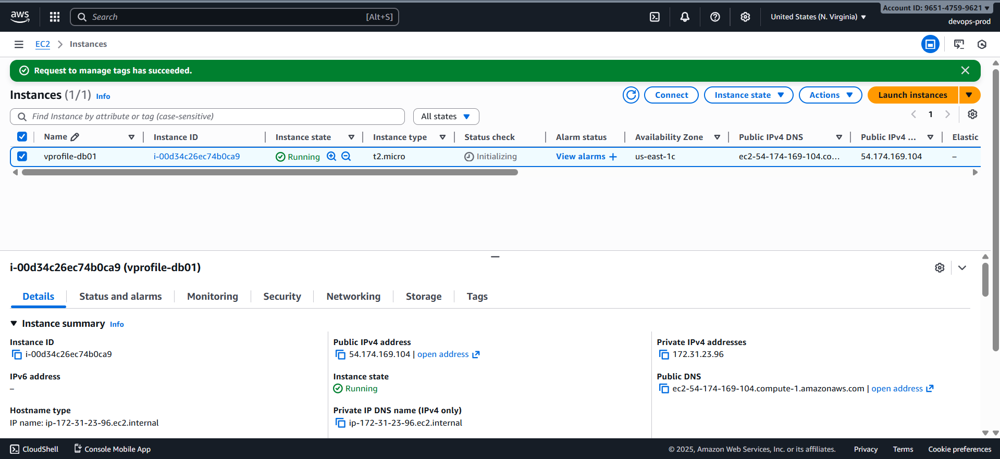
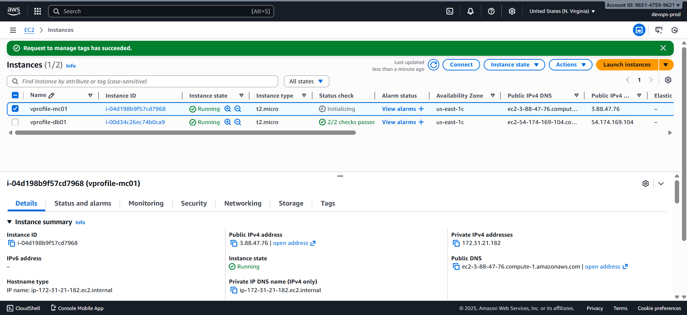
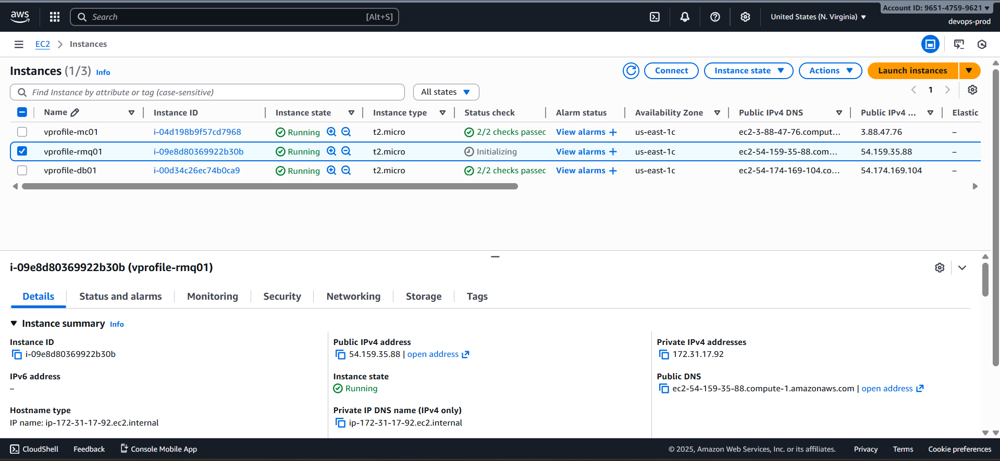
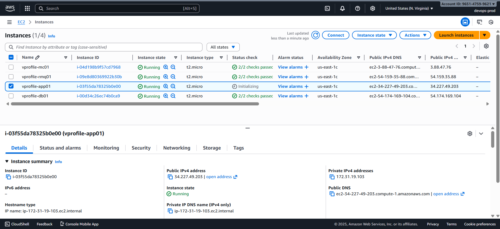

# 🚀 EC2 Instance Creation for VProfile Application

---

Create the required EC2 instances using the parameters below. Each instance includes tags, AMI selection, instance type, security group assignment, storage configuration, and a user data script for automated setup.

---

### 1️⃣ `db01` MySQL Database Server

**Instance Details**

- **Name:** `vprofile-db01`
- **Tags:**

  - `name: vprofile-db01`
  - `project: vprofile`

- **AMI:** Amazon Linux 2023
- **Instance Type:** `t2.micro`
- **Key Pair:** `vprofile-kp.pem`
- **Security Group:** `vprofile-backend-sg`

**Storage**

- Size: **8 GB**
- Type: **gp3**

**User Data**

- `mysql_script` → `../../vprofile_app/userdata/mysql.sh`

---

### 2️⃣ `mc01` Memcached Server

**Instance Details**

- **Name:** `vprofile-mc01`
- **Tags:**

  - `name: vprofile-mc01`
  - `project: vprofile`

- **AMI:** Amazon Linux 2023
- **Instance Type:** `t2.micro`
- **Key Pair:** `vprofile-kp.pem`
- **Security Group:** `vprofile-backend-sg`

**Storage**

- Size: **8 GB**
- Type: **gp3**

**User Data**

- `memcached_script` → `../../vprofile_app/userdata/memcache.sh`

---

### 3️⃣ `rmq01` RabbitMQ Server

**Instance Details**

- **Name:** `vprofile-rmq01`
- **Tags:**

  - `name: vprofile-rmq01`
  - `project: vprofile`

- **AMI:** Amazon Linux 2023
- **Instance Type:** `t2.micro`
- **Key Pair:** `vprofile-kp.pem`
- **Security Group:** `vprofile-backend-sg`

**Storage**

- Size: **8 GB**
- Type: **gp3**

**User Data**

- `rabbitmq_script` → `../../vprofile_app/userdata/rabbitmq.sh`

---

### 4️⃣ `app01` Tomcat Application Server

**Instance Details**

- **Name:** `vprofile-app01`
- **Tags:**

  - `name: vprofile-app01`
  - `project: vprofile`

- **AMI:** Ubuntu
- **Instance Type:** `t2.micro`
- **Key Pair:** `vprofile-kp.pem`
- **Security Group:** `vprofile-app-sg`

**Storage**

- Size: **8 GB**
- Type: **gp3**

**User Data**

- `tomcat_script` → `../../vprofile_app/userdata/tomcat_ubuntu.sh`

---
