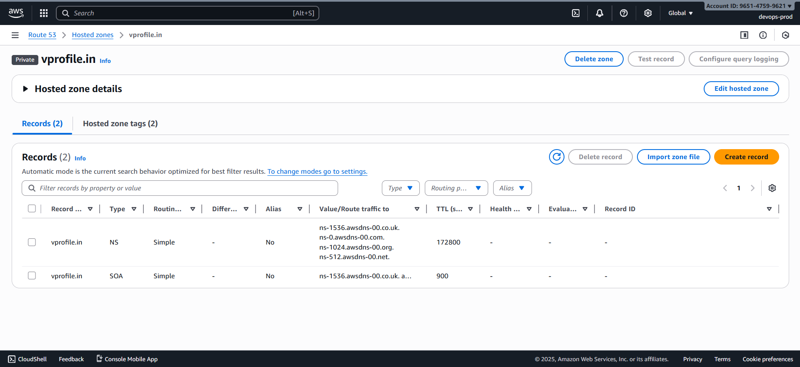
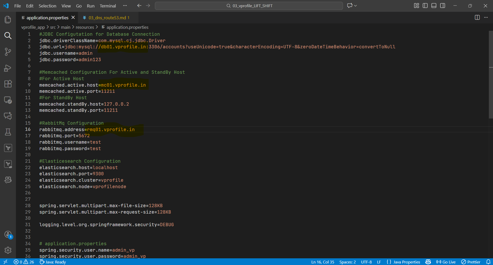

# 🌐 Route53 Private DNS Setup for Backend Service Discovery

---

The application server (`app01`) needs to communicate with backend services (`db01`, `mc01`, `rmq01`). Since using **private IP addresses inside `application.properties` is not scalable**, we use **Route53 Private Hosted Zone** to create stable DNS names that map to each instance’s private IP.

**This ensures:**

- No changes needed when backend instance IPs change
- Auto Scaling and re-deployments become easier
- Only resources inside the VPC can resolve these DNS names

---

### 🏷️ 1️⃣ Create Private Hosted Zone

In **Route53 → Hosted Zones → Create Hosted Zone**

- **Domain Name:** `vprofile.in`
- **Type:** _Private Hosted Zone_
- **Region:** `us-east-1 (N. Virginia)`
- **Associate with VPC:** _Default VPC_



---

### 🗂️ 2️⃣ Create DNS Records

Create A-records for each backend service.

#### 🔸 db01

- **Record Name:** `db01.vprofile.in`
- **Type:** A — IPv4
- **Value:** `<private-ip-of-db01>`

---

#### 🔸 mc01

- **Record Name:** `mc01.vprofile.in`
- **Type:** A — IPv4
- **Value:** `<private-ip-of-mc01>`

---

#### 🔸 rmq01

- **Record Name:** `rmq01.vprofile.in`
- **Type:** A — IPv4
- **Value:** `<private-ip-of-rmq01>`

---

#### 🔸 app01

(Useful for internal DNS resolution or ALB health checks)

- **Record Name:** `app01.vprofile.in`
- **Type:** A — IPv4
- **Value:** `<private-ip-of-app01>`

---


---

### 🛠️ 3️⃣ Update `application.properties` file

Edit the application configuration (local code) to use DNS names instead of IP addresses.

Example:

```properties
db.host=db01.vprofile.in
mc.host=mc01.vprofile.in
rmq.host=rmq01.vprofile.in
```



---
