# 🎒 S3 Bucket, IAM Roles & Artifact Deployment

---

This section covers creating an S3 bucket for storing build artifacts, configuring IAM access, and deploying the WAR file to the Tomcat application server.

---

### 🪣 1️⃣ Create S3 Bucket

**Bucket Details**

- **Name:** `vprofile-artifact`
- **Object Ownership:** ACLs disabled
- **Block Public Access:** Enabled
- **Versioning:** Disabled
- **Region:** `us-east-1 (N. Virginia)`
- **Bucket Type:** General Purpose

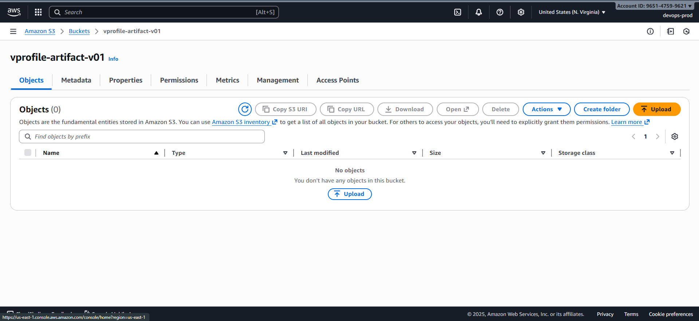

---

### 🔐 2️⃣ Create IAM user for CLI Upload

#### Role: `vprofile-s3-admin-user`

- Policy Type: _Attach existing policies directly_
- Policy: **AmazonS3FullAccess**

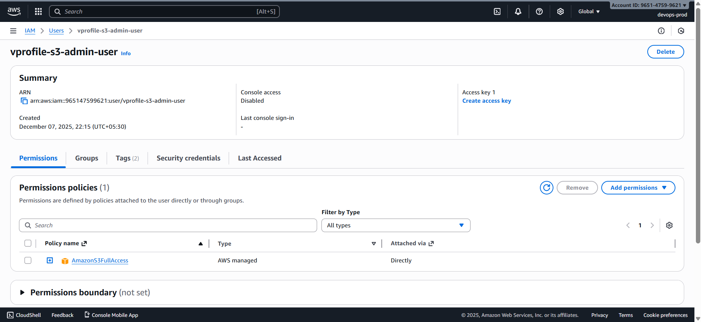

#### Create Access Keys

- Use case: **Command Line Interface**
- Download CSV containing:

  - Access Key ID
  - Secret Access Key

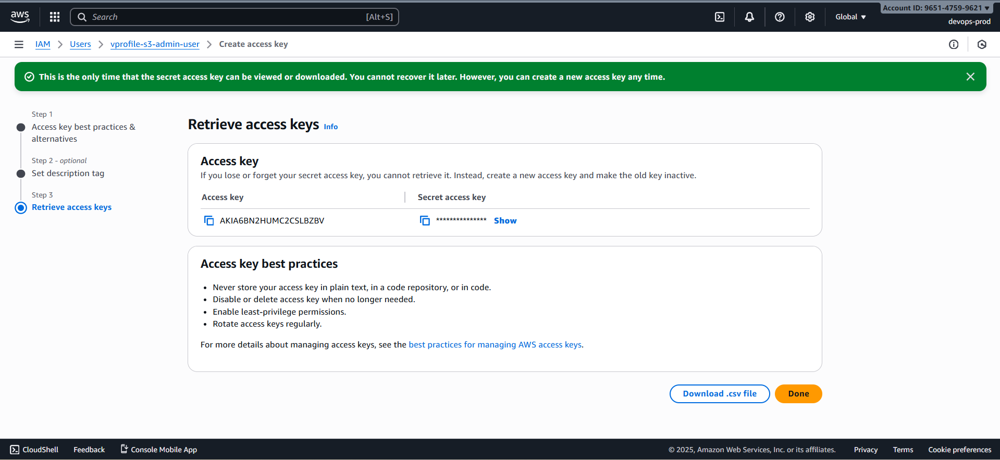

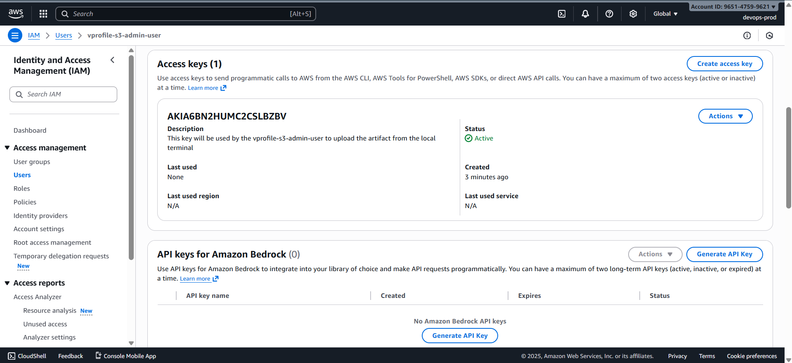

You’ll use these credentials to upload artifacts from your local machine.

---

### 🔐 3️⃣ Create IAM Role for EC2 Access to S3

#### Role: `vprofile-ec2-s3-access-role`

- **Trusted Entity:** AWS Service
- **Use Case:** EC2
- **Attached Policy:** `AmazonS3FullAccess`

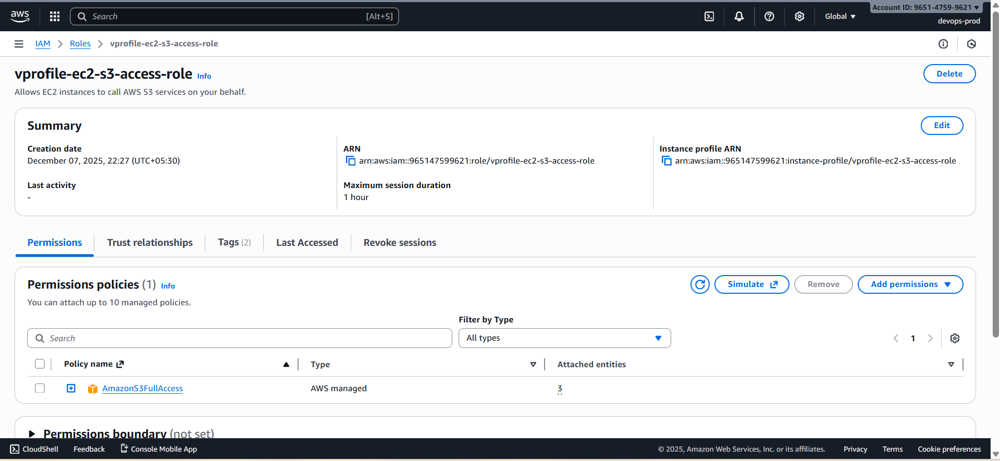

**Note** this role name—will be applied to `app01` instance.

---

### 🖇️ 4️⃣ Attach IAM Role to `app01`

**EC2 → app01 → Actions → Security → Modify IAM Role**

Select:

```
vprofile-ec2-s3-access-role
```

Update role assignment.

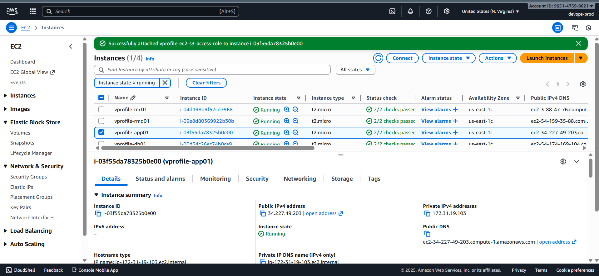

---

### 📦 5️⃣ Build & Upload Artifact to S3

In VS Code terminal:

#### Verify Dependencies

```bash
mvn -v               # checks Maven availability
aws --version        # checks AWS CLI availability
```

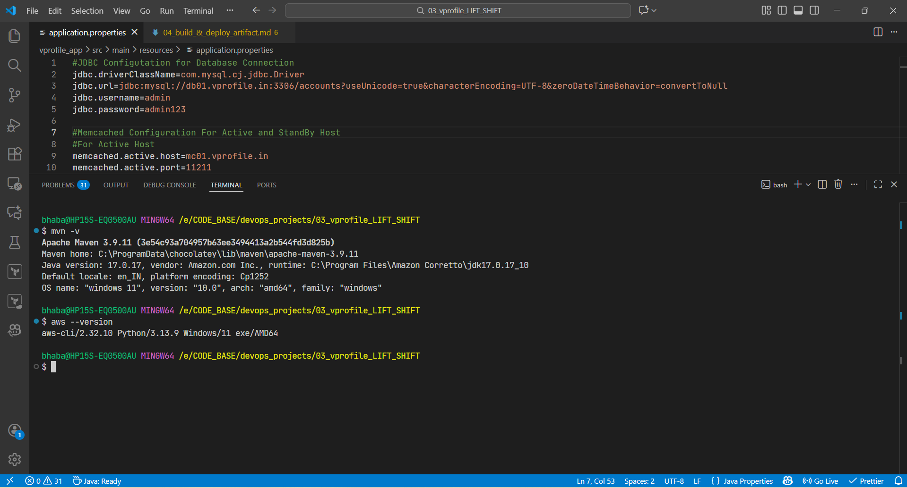

#### Build the Artifact

```bash
mvn install
```

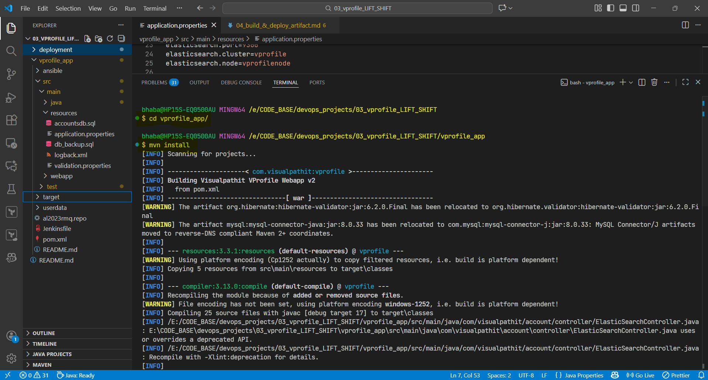

A WAR file will appear in the `target/` directory.

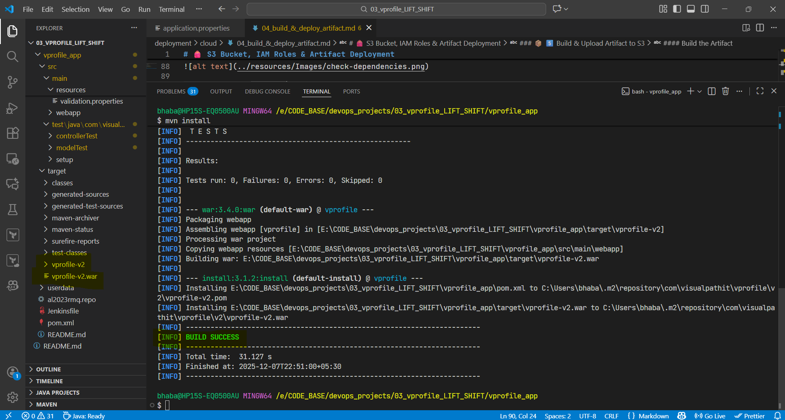

---

#### Configure AWS CLI

```bash
aws configure
```

Enter:

- Access Key ID
- Secret Access Key
- Region: `us-east-1`
- Output Format: `YAML`

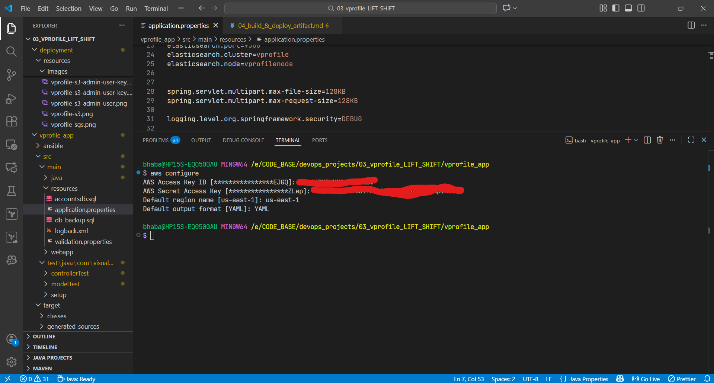

---

#### Upload WAR File to S3

```bash
aws aws s3 cp target/vprofile-v2.war s3://vprofile-artifact-v01/
aws s3 ls s3://vprofile-artifact-v01/
```

Verify the file is uploaded.

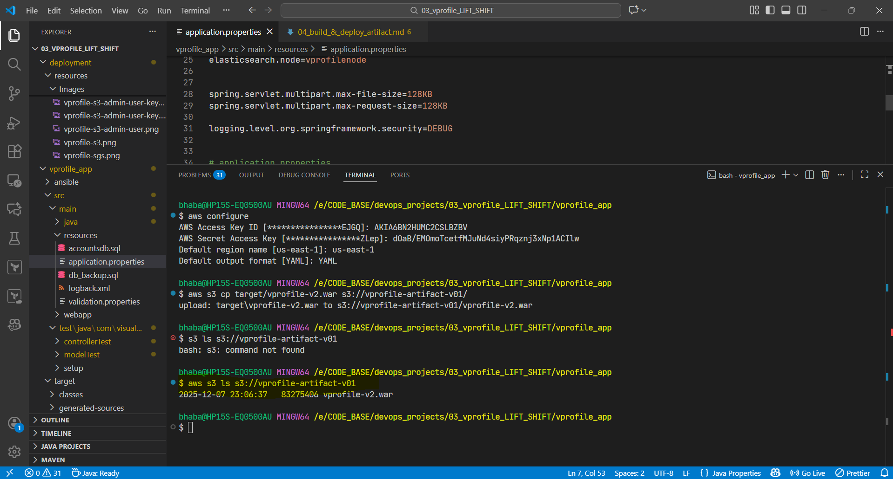

---

### 🧩 6️⃣ Deploy Artifact to Tomcat on EC2

#### Log in to `app01`

```bash
ssh -i vprofile-keypair.pem ubuntu@<EC2-Public-IP>
sudo -i
```

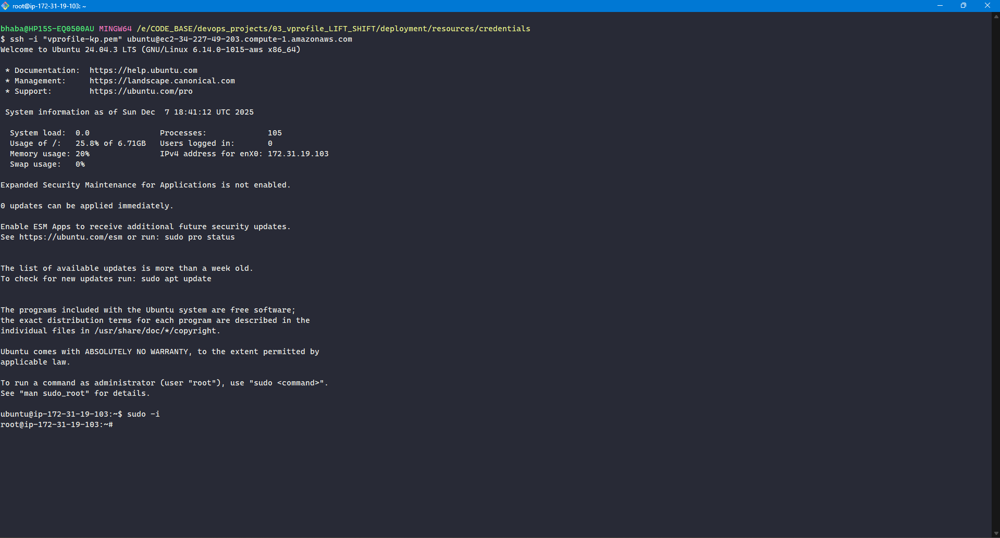

---

#### Install AWS CLI (if not installed)

```bash
snap install aws-cli --classic
aws --version
```


---

#### Download Artifact from S3

```bash
aws s3 cp s3://vprofile-artifact-v01/vprofile-v2.war /tmp/
```

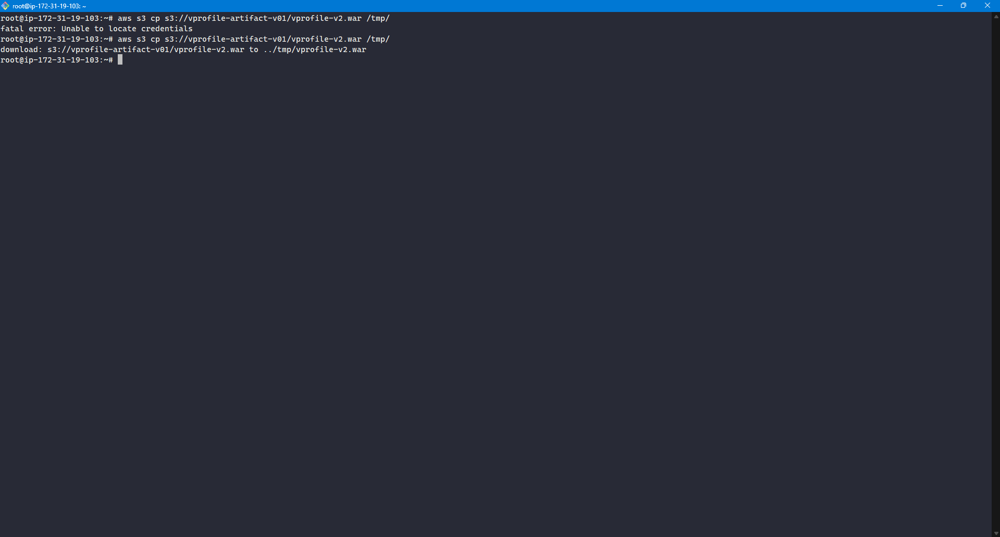

---

#### Stop Tomcat

```bash
systemctl stop tomcat10
```

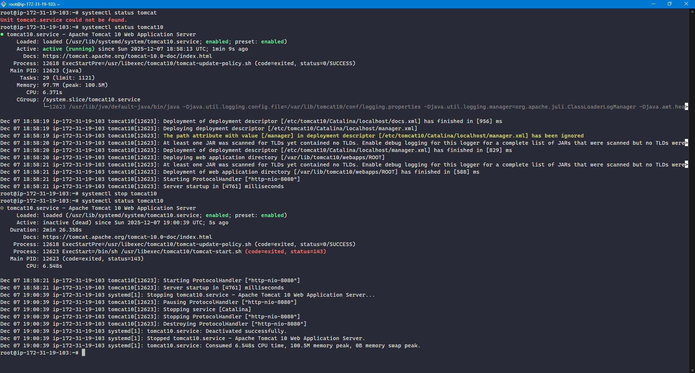

#### Remove Existing ROOT App

```bash
ls /var/lib/tomcat10/webapps
rm -rf /var/lib/tomcat10/webapps/ROOT
```

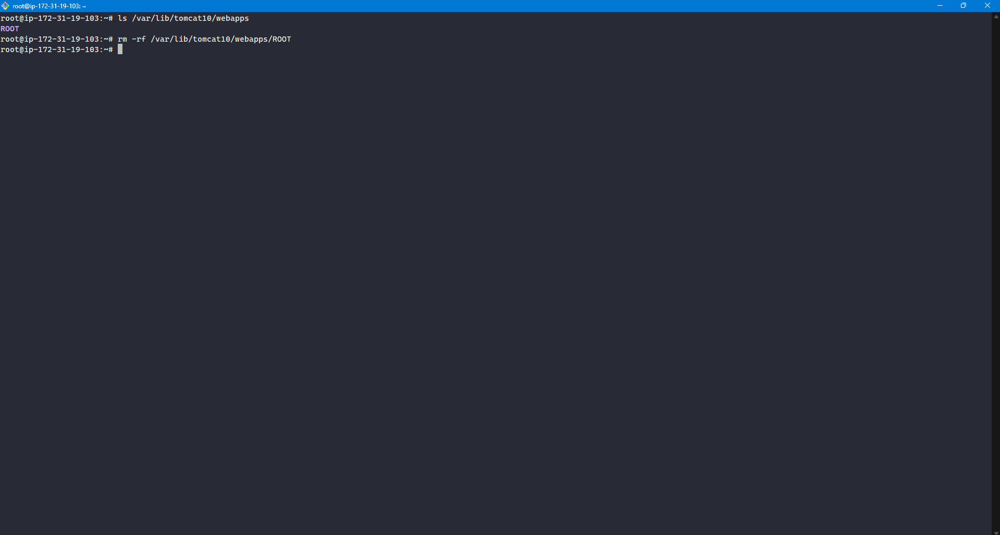

#### Deploy the New WAR File

```bash
cp /tmp/vprofile-v2.war /var/lib/tomcat10/webapps/ROOT.war
```

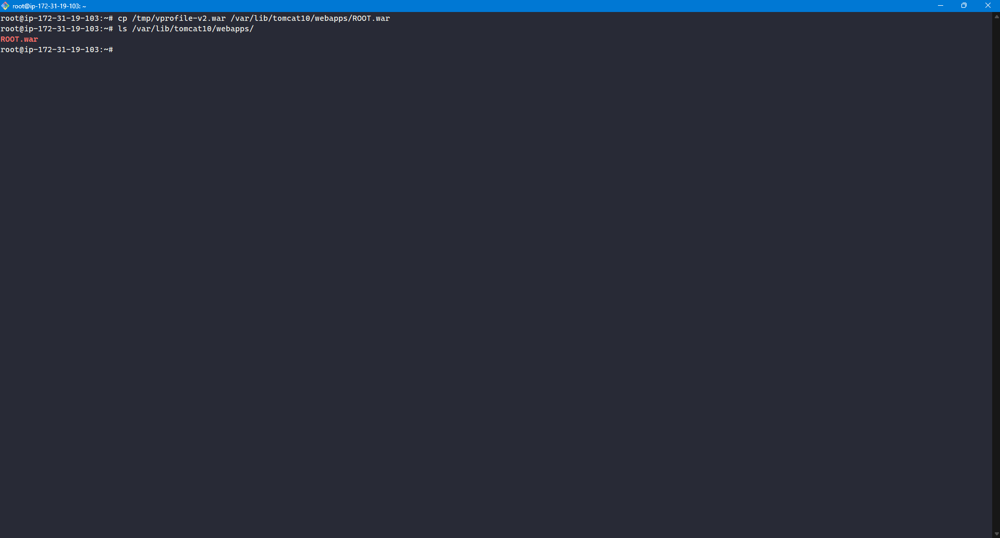

#### Start Tomcat

```bash
systemctl start tomcat10
```

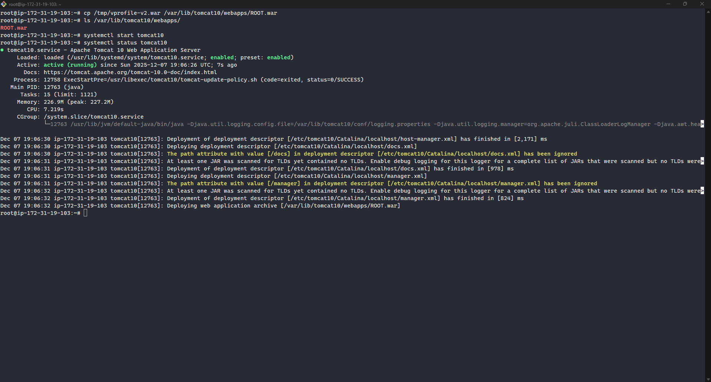

---
