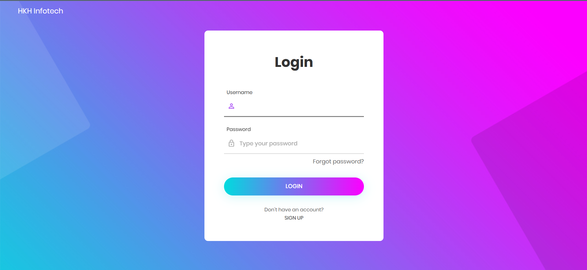
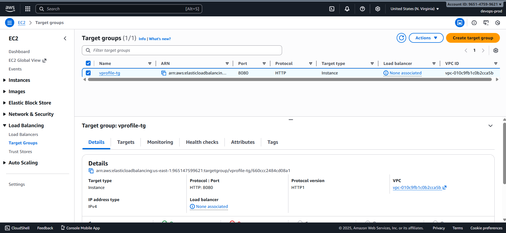
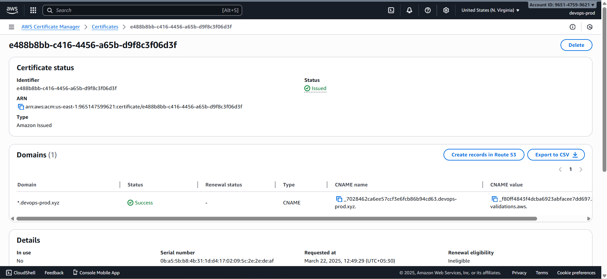
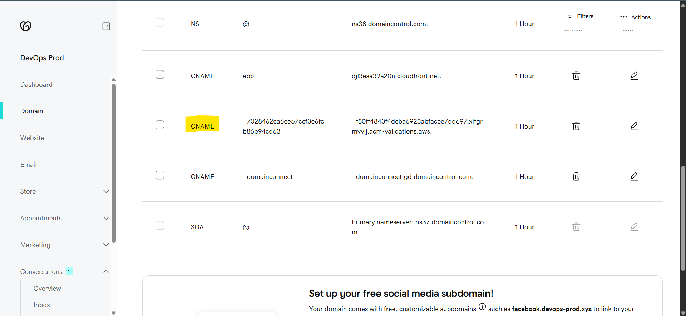
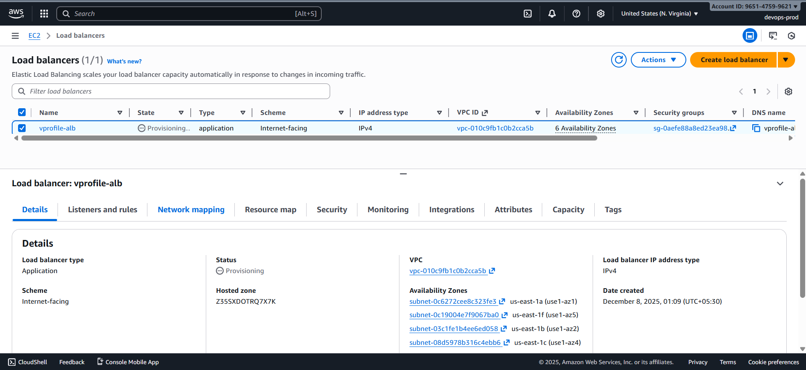
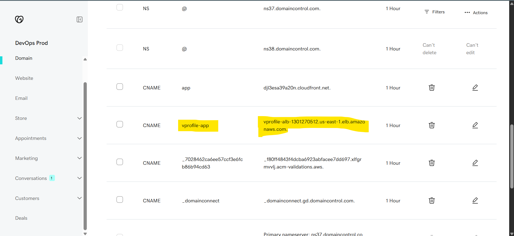

# ⚖️ Load Balancer & DNS Configuration

---

The application requires an **Application Load Balancer (ALB)** to distribute traffic across instances and ensure high availability. DNS is then configured to map the application domain to the ALB endpoint.

---

### ✅ 1️⃣ Verify Application Is Running

Before creating a load balancer, confirm `app01` is serving traffic:

```
http://<ec2-public-ip>:8080
```

If the page loads, continue.



---

### 🎯 2️⃣ Create Target Group

**Path:** EC2 Dashboard → Load Balancing → Target Groups → Create Target Group

- **Target Type:** Instance
- **Name:** `vprofile-tg`
- **Protocol:** HTTP
- **Port:** 8080
- **Health Check Port:** Override → `8080`

**Register Targets:**

- Select `app01` and add it to the target group.



---

### 🔐 3️⃣ Create SSL Certificate (ACM)

(Required for HTTPS)

**Steps:**

1. Go to **AWS Certificate Manager → Request Certificate**
2. Select **Public Certificate**
3. Enter domain:

   ```
   *.yourdomain.com
   ```

4. Validation Method: **DNS Validation**
5. ACM provides a **CNAME record**
   Add this CNAME to your domain registrar (e.g., GoDaddy)
6. Key Algorithm: **RSA_2048**
7. Wait for validation to complete.





---

### 🌐 4️⃣ Create Application Load Balancer (ALB)

**Path:** EC2 Dashboard → Load Balancers → Create Load Balancer → _Application Load Balancer_

- **Name:** `vprofile-alb`
- **Scheme:** Internet-facing
- **AZs:** Select all Availability Zones
- **Security Group:** Use existing security group (e.g., `vprofile-sg`)
- **Listeners:**

  - HTTP (80)
  - HTTPS (443)

**Listener Rules:**

- **Default Action:** Forward to `vprofile-tg`
- **HTTPS Listener:** Attach the ACM certificate created earlier

**Create Load Balancer.**



---

### 📝 5️⃣ Note Load Balancer DNS Name

After creation, copy the DNS name:

```
vprofile-alb-123456.us-east-1.elb.amazonaws.com
```

---

### 🌍 6️⃣ Update Domain DNS (GoDaddy or Registrar)

Create a **CNAME record**:

| Type  | Name                 | Value            |
| ----- | -------------------- | ---------------- |
| CNAME | `www.yourdomain.com` | `<ALB-DNS-Name>` |

Example:

```
www → vprofile-alb-123456.us-east-1.elb.amazonaws.com
```



Wait for DNS propagation (usually a few minutes).
