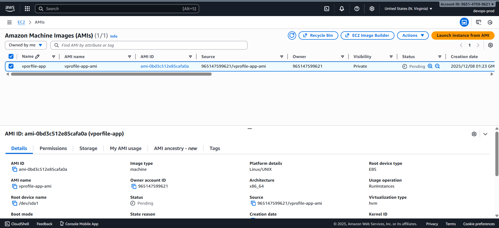
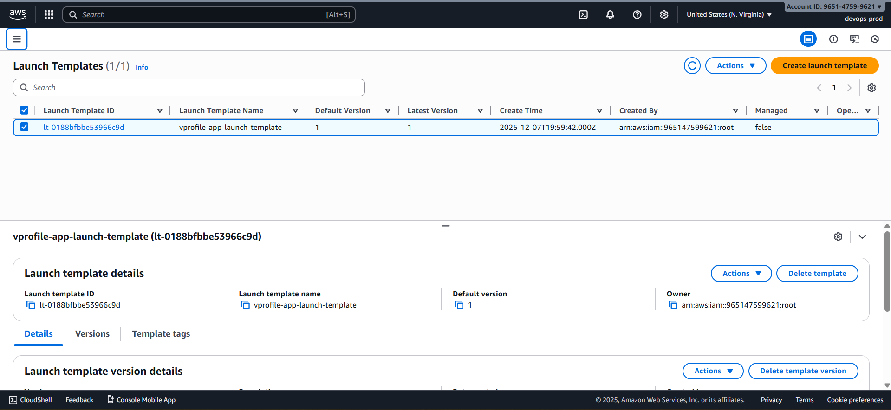
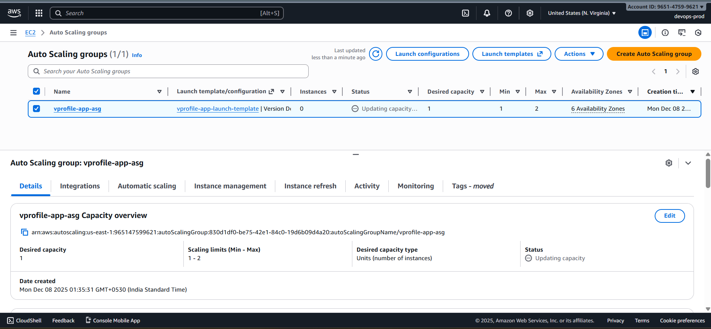
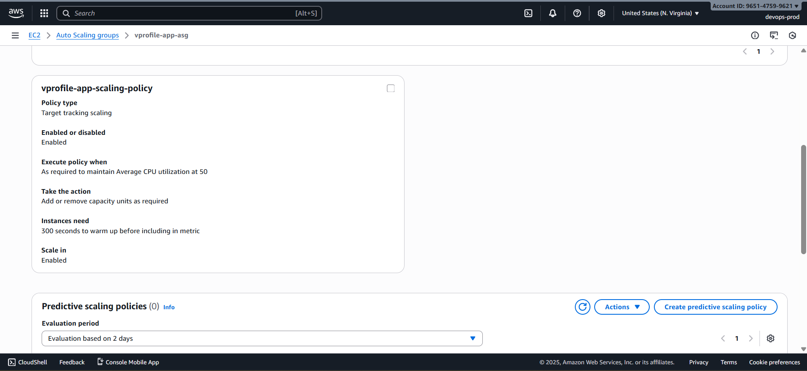
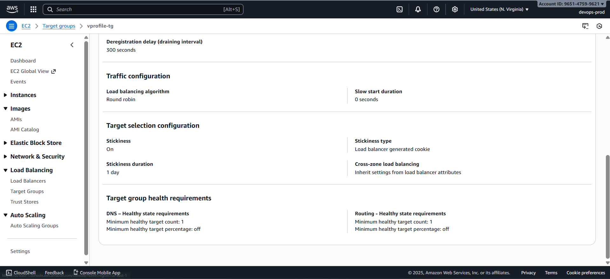

# 🚀 Auto Scaling Group (ASG) Setup

---

Auto Scaling ensures the application tier can scale automatically based on traffic or resource utilization. Below are the steps to create an AMI, launch template, and Auto Scaling Group.

---

### 📸 1️⃣ Create AMI from `app01`

- Go to **EC2 → Instances → app01**
- Actions → Image and Templates → **Create Image**
- **Name:** `vprofile-app-ami`
- Create AMI and wait for it to become _available_

---

### 🏗️ 2️⃣ Create Launch Template

**Path:** EC2 → Launch Templates → Create Launch Template

Values:

- **Name:** `vprofile-app-launch-template`
- **AMI:** `vprofile-app-ami`
- **Instance Type:** `t2.micro`
- **Key Pair:** `vprofile-keypair`
- **IAM Role:** `s3-access-role`
- **Security Group:** `vprofile-app-sg`

Save the template.

---

### 📈 3️⃣ Create Auto Scaling Group

**Path:** EC2 → Auto Scaling Groups → Create ASG

- **Name:** `vprofile-app-asg`
- **Launch Template:** `vprofile-app-launch-template`
- **AZs:** Select _all_ availability zones in the region

#### Load Balancer Integration

- Attach to existing ALB: `vprofile-app-lb`
- Select Target Group: `vprofile-tg`

#### Health Check

- **Type:** ELB

#### Capacity Settings

- **Desired:** 1
- **Minimum:** 1
- **Maximum:** 2

Create the ASG.

---

### 📊 4️⃣ Create Scaling Policy

**Policy Type:** Target Tracking Scaling Policy

Values:

- **Policy Name:** `vprofile-app-scaling-policy`
- **Metric:** Average CPU Utilization
- **Target Value:** 50%
- **Adjustment Type:** Change in capacity
- **Cooldown:** 300 seconds

---

### 🍪 5️⃣ Enable Load Balancer Stickiness

For session persistence:

- Go to **Target Group → Attributes**
- Enable **Stickiness**
- Choose duration (default works fine)

---
