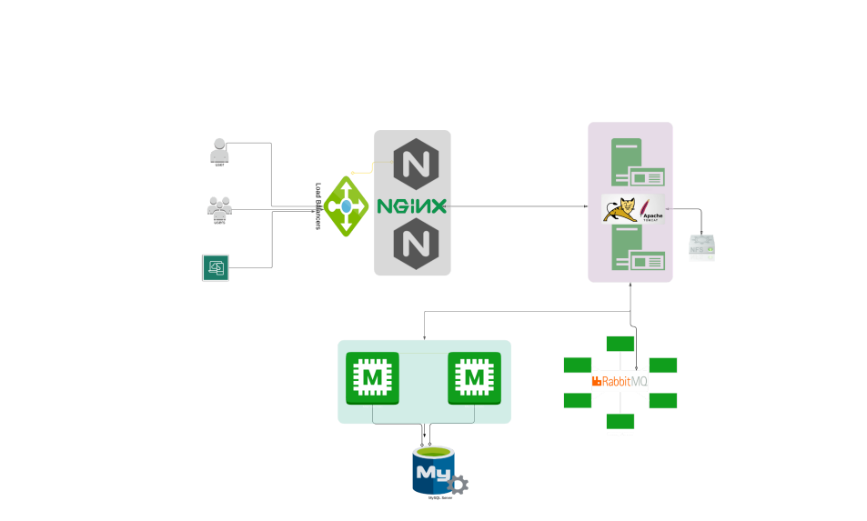

# 🧰 VProfile Project (Local setup)

This documentation provides a complete step-by-step guide to provisioning the **VProfile** multi-tier application locally using **Vagrant**, **VirtualBox**, and manually configured services.



The architecture consists of:

- **Nginx** (Web Layer)
- **Tomcat** (Application Layer)
- **RabbitMQ** (Messaging Broker)
- **Memcached** (Caching Layer)
- **MySQL/MariaDB** (Database Layer)

---

## 📌 1. Prerequisites

Ensure the following tools are installed on your machine:

- **Oracle VirtualBox**
- **Vagrant**
- **Git Bash** or any equivalent terminal
- **Vagrant Hostmanager Plugin**

Install the plugin:

```bash
vagrant plugin install vagrant-hostmanager
```

---

## 📦 2. Virtual Machine Setup

#### 2.1 Clone the Repository

```bash
git clone <repository-url>
cd <repo-folder>
git checkout main
cd vagrant/Manual_provisioning
```

#### 2.2 Start All VMs

```bash
vagrant up
```

> **Note:** VM provisioning may take several minutes depending on system performance. If provisioning stops mid-way, simply rerun `vagrant up`

> **INFO:** Hostnames and `/etc/hosts` entries are auto-managed by Hostmanager.

---

## ⚙️ 3. Service Provisioning Order

As described in the setup diagram, services must be installed in the following order:


1. **MySQL** – Database Service
2. **Memcached** – Caching Layer
3. **RabbitMQ** – Message Broker
4. **Tomcat** – Application Server
5. **Nginx** – Web Server

---

## 🗄️ 4. MySQL (MariaDB) Configuration `db01`

#### 4.1 Access VM

```bash
vagrant ssh db01
```

#### 4.2 Update OS & Install Dependencies

```bash
sudo yum update -y
sudo yum install epel-release -y
sudo yum install git mariadb-server -y
```

#### 4.3 Start & Enable MariaDB

```bash
sudo systemctl start mariadb
sudo systemctl enable mariadb
```

#### 4.4 Run Secure Installation

Set a root password (`admin123`). Follow prompts to remove anonymous users, disable test DB, etc.

**Run:**

```bash
sudo mysql_secure_installation
```

```bash
Set root password? [Y/n] Y
New password:
Re-enter new password:
Password updated successfully!
Reloading privilege tables..
... Success!
By default, a MariaDB installation has an anonymous user, allowing anyone
to log into MariaDB without having to have a user account created for
them. This is intended only for testing, and to make the installation
go a bit smoother. You should remove them before moving into a
production environment.
Remove anonymous users? [Y/n] Y
... Success!
Normally, root should only be allowed to connect from 'localhost'. This
ensures that someone cannot guess at the root password from the network.
Disallow root login remotely? [Y/n] n
... skipping.
By default, MariaDB comes with a database named 'test' that anyone can
access. This is also intended only for testing, and should be removed
before moving into a production environment.
Remove test database and access to it? [Y/n] Y
- Dropping test database...
... Success!
- Removing privileges on test database...
... Success!
Reloading the privilege tables will ensure that all changes made so far
will take effect immediately.
Reload privilege tables now? [Y/n] Y
... Success!
```

#### 4.5 Create Database & User

```bash
mysql -u root -padmin123
```

**Inside MySQL:**

```sql
mysql> create database accounts;
mysql> grant all privileges on accounts.* TO 'admin'@'%' identified by 'admin123';
mysql> FLUSH PRIVILEGES;
mysql> exit;
```

#### 4.6 Load Database Schema

```bash
git clone -b main https://github.com/hkhcoder/vprofile-project.git
cd vprofile-project
mysql -u root -padmin123 accounts < src/main/resources/db_backup.sql
mysql -u root -padmin123 accounts

mysql> show tables;
mysql> exit;
```

#### 4.7 Open Firewall Port 3306

```bash
systemctl start firewalld
systemctl enable firewalld
firewall-cmd --get-active-zones
firewall-cmd --zone=public --add-port=3306/tcp --permanent
firewall-cmd --reload
systemctl restart mariadb
```

---

## 💾 5. Memcached Setup `mc01`

#### 5.1 Access VM

```bash
vagrant ssh mc01
```

#### 5.2 Install & Configure Memcached

```bash
sudo yum update -y
sudo dnf install epel-release -y
sudo dnf install memcached -y
sudo systemctl start memcached
sudo systemctl enable memcached
```

#### 5.3 Allow Remote Connections

```bash
sudo sed -i 's/127.0.0.1/0.0.0.0/g' /etc/sysconfig/memcached
sudo systemctl restart memcached
```

#### 5.4 Open Firewall Ports (11211 TCP & 11111 UDP)

```bash
sudo firewall-cmd --add-port=11211/tcp
sudo firewall-cmd --runtime-to-permanent
sudo firewall-cmd --add-port=11111/udp
sudo firewall-cmd --runtime-to-permanent
sudo memcached -p 11211 -U 11111 -u memcached -d
```

---

## 📡 6. RabbitMQ Setup `rmq01`

#### 6.1 Access VM

```bash
vagrant ssh rmq01
```

#### 6.2 Install RabbitMQ & Dependencies

```bash
sudo yum update -y
sudo yum install epel-release wget -y
cd /tmp/
sudo dnf -y install centos-release-rabbitmq-38
sudo dnf --enablerepo=centos-rabbitmq-38 -y install rabbitmq-server
sudo systemctl enable --now rabbitmq-server
```

#### 6.3 Create Admin User

```bash
sudo sh -c 'echo "[{rabbit, [{loopback_users, []}]}]." > /etc/rabbitmq/rabbitmq.config'
sudo rabbitmqctl add_user test test
sudo rabbitmqctl set_user_tags test administrator
sudo systemctl restart rabbitmq-server
```

#### 6.4 Open Firewall Port 5672

```bash
sudo firewall-cmd --add-port=5672/tcp
sudo firewall-cmd --runtime-to-permanent
```

---

## 🐱 7. Tomcat Application Server `app01`

#### 7.1 Access VM

```bash
vagrant ssh app01
```

#### 7.2 Install dependencies

```bash
sudo yum update -y
sudo yum install epel-release -y
sudo dnf -y install java-11-openjdk java-11-openjdk-devel
sudo dnf install git maven wget -y
```

#### 7.3 Install Tomcat 9

```bash
cd /tmp
wget https://archive.apache.org/dist/tomcat/tomcat-9/v9.0.75/bin/apache-tomcat-9.0.75.tar.gz
tar xzvf apache-tomcat-9.0.75.tar.gz
```

**Create tomcat user and move files:**

```bash
sudo useradd --home-dir /usr/local/tomcat --shell /sbin/nologin tomcat
sudo cp -r apache-tomcat-9.0.75/* /usr/local/tomcat/
sudo chown -R tomcat:tomcat /usr/local/tomcat
```

#### 7.4 Configure Systemd Service

**Create service file:**

```bash
sudo vi /etc/systemd/system/tomcat.service
```

**Paste config:**

```ini
[Unit]
Description=Tomcat Application Server
After=network.target

[Service]
User=tomcat
WorkingDirectory=/usr/local/tomcat
Environment=JAVA_HOME=/usr/lib/jvm/jre
Environment=CATALINA_HOME=/usr/local/tomcat
ExecStart=/usr/local/tomcat/bin/catalina.sh run
ExecStop=/usr/local/tomcat/bin/shutdown.sh
SyslogIdentifier=tomcat

[Install]
WantedBy=multi-user.target
```

**Load and start service:**

```bash
sudo systemctl daemon-reload
sudo systemctl start tomcat
sudo systemctl enable tomcat
```

#### 7.5 Expose Port 8080

```bash
sudo firewall-cmd --zone=public --add-port=8080/tcp --permanent
sudo firewall-cmd --reload
```

---

## 🏗️ 8. Build & Deploy Application to Tomcat

#### 8.1 Clone Source Code

```bash
git clone -b main https://github.com/hkhcoder/vprofile-project.git
cd vprofile-project
```

**Update backend config:**

```bash
vim src/main/resources/application.properties
```

#### 8.2 Build Artifact

```bash
mvn install
```

#### 8.3 Deploy to Tomcat

```bash
sudo systemctl stop tomcat
sudo rm -rf /usr/local/tomcat/webapps/ROOT*
sudo cp target/vprofile-v2.war /usr/local/tomcat/webapps/ROOT.war
sudo chown tomcat:tomcat /usr/local/tomcat/webapps -R
sudo systemctl restart tomcat
```

---

## 🌐 9. Nginx Web Layer `web01`

#### 9.1 Access VM

```bash
vagrant ssh web01
sudo -i
```

#### 9.2 Install Nginx

```bash
apt update && apt upgrade -y
apt install nginx -y
```

#### 9.3 Create Reverse Proxy Config

```bash
vi /etc/nginx/sites-available/vproapp
```

**Insert:**

```nginx
upstream vproapp {
    server app01:8080;
}

server {
    listen 80;
    location / {
        proxy_pass http://vproapp;
    }
}
```

**Enable the site:**

```bash
rm -rf /etc/nginx/sites-enabled/default
ln -s /etc/nginx/sites-available/vproapp /etc/nginx/sites-enabled/vproapp
systemctl restart nginx
```

---

## 🎉 Setup Complete!

Your VProfile multi-tier application should now be fully accessible via the **web01** VM’s IP on port **80**.

---
